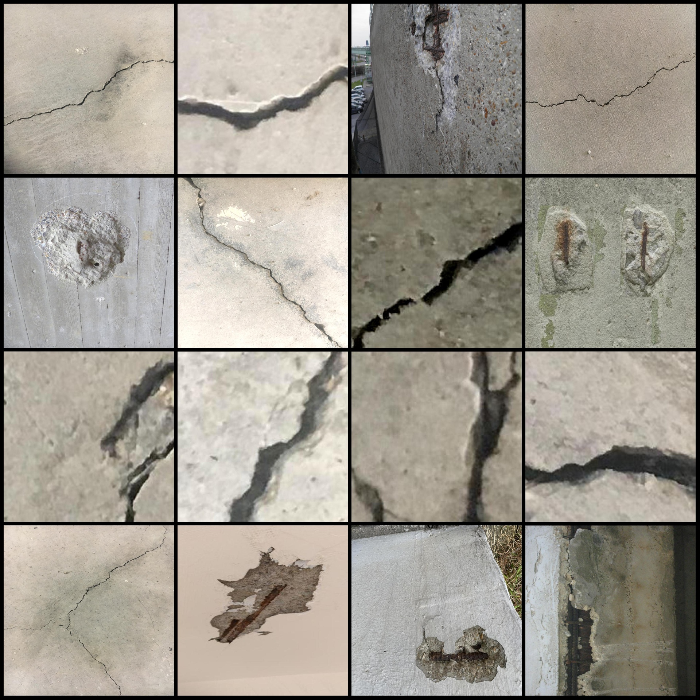
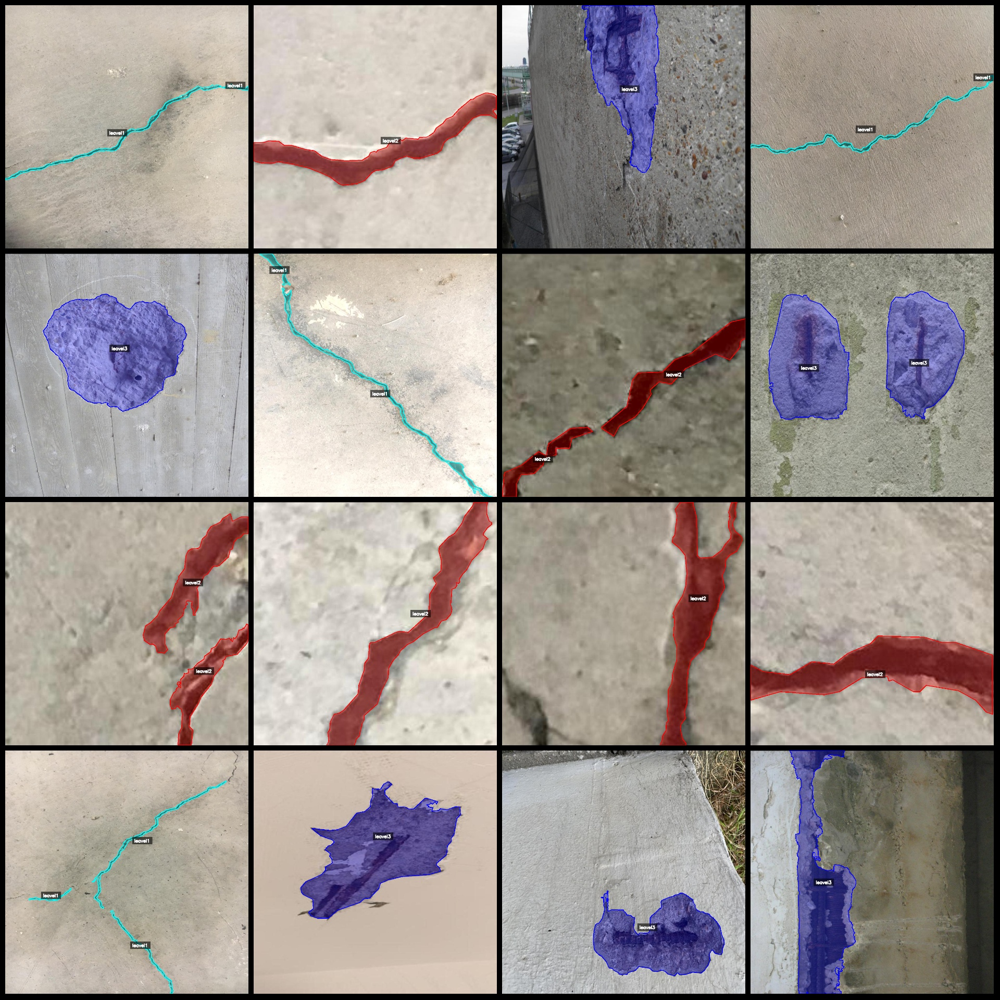
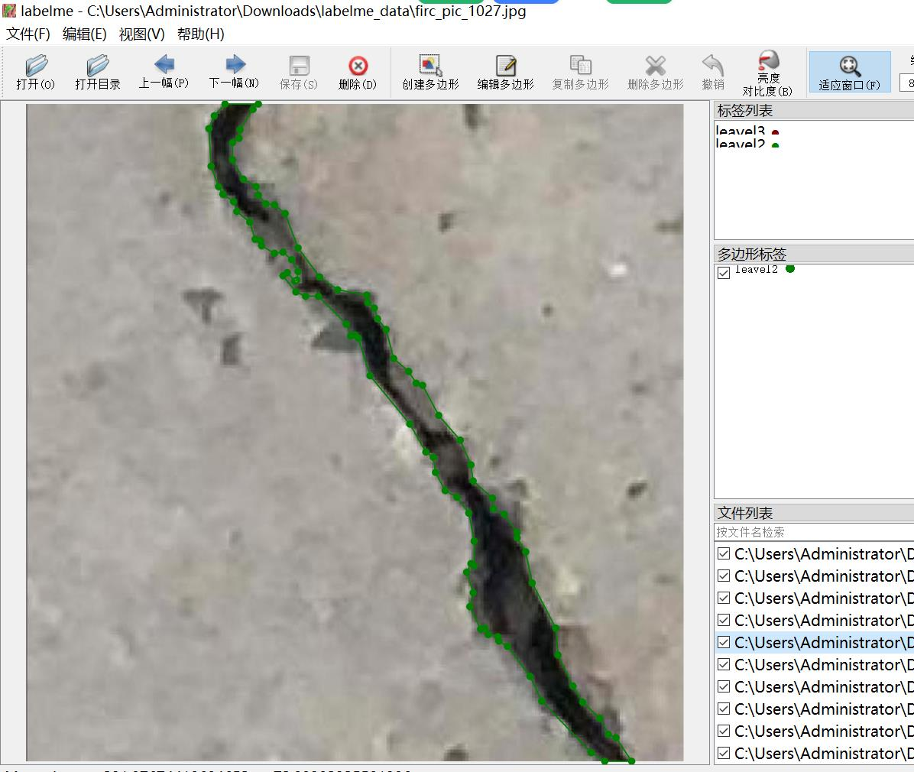
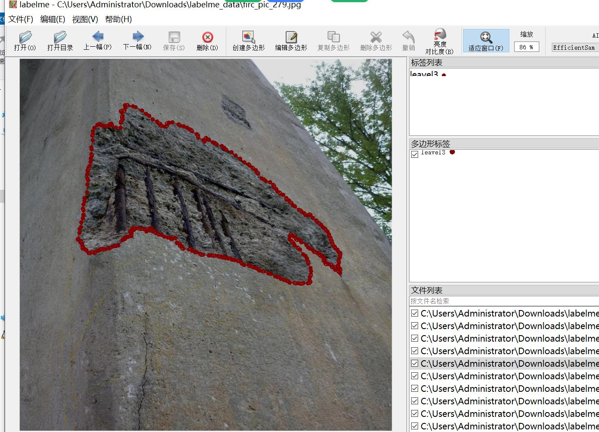

# Wall, Surface, Bridge and Building Wall Cracks Width and Crack Level Identification and Segmentation Dataset

**Dataset Format:** labelme format (without mask files, only containing jpg images and corresponding json files)

**Number of Images:** 2996
**Number of Annotated Items:** 2996
**Number of Annotated Categories:** 3
**Annotated Category Names:** ["leavel1", "leavel2", "leavel3"]
**Each Category's Counts:**
- leavel1 (small crack width): count = 1587
- leavel2 (large crack width): count = 1152
- leavel3 (peeling): count = 1726
**Total Boxes Count:** 4465

**Annotation Tool:** labelme version 5.5.0

**Image Resolution:** 1000x1000

**Annotation Rules:** Polygon is drawn around the category.

**Important Notice:** The dataset can be opened and edited using labelme; however, the json dataset needs to be converted into either a mask or YOLO/COCO format for semantic segmentation or instance 
segmentation.

**Special Statement:** This dataset does not guarantee the accuracy of the trained model or weight files.

**Image Preview:**

**Example of Annotation:**

**Randomly selected 16 images:**

**Annotation drawing results:**

**Labelme editing example image:**

## Images

Here is a pay link on Stripe ( https://buy.stripe.com/3cs8yP7sY87d0vu9AB ). Please contact me lonlonago@foxmail.com after funding $89, and I will send you a complete data files , thank you!

